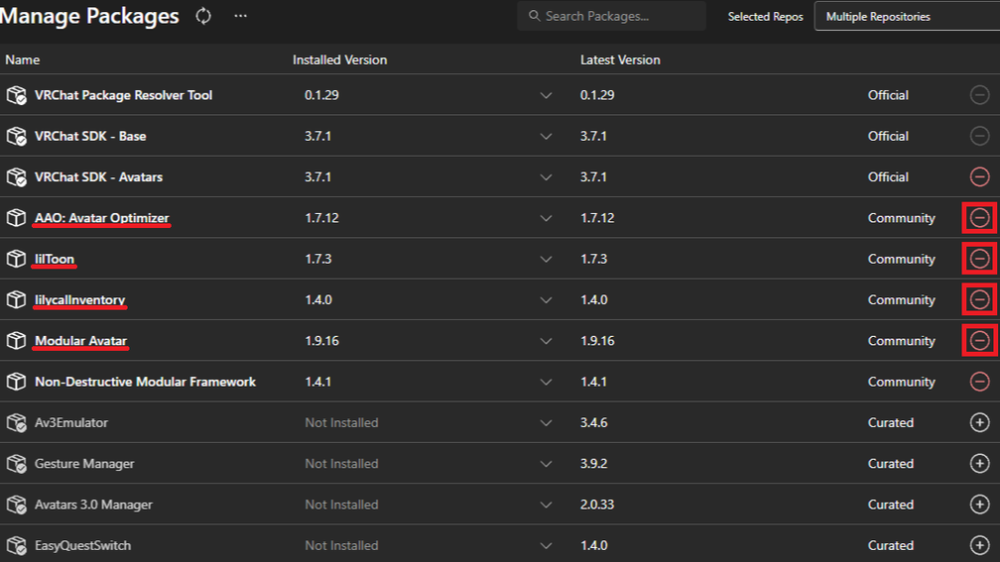

更新日：2024年9月4日
# 基本的なアバターのアップロード方法

- [基本的なアバターのアップロード方法](#基本的なアバターのアップロード方法)
  - [解説する環境](#解説する環境)
  - [アップロードするための確認](#アップロードするための確認)
    - [**VRChatアカウントを所持しているか確認**](#vrchatアカウントを所持しているか確認)
    - [**Unityアカウントを所持しているか確認**](#unityアカウントを所持しているか確認)
    - [**アバターの３Ｄモデルを所持しているか確認**](#アバターの３ｄモデルを所持しているか確認)
    - [**トラストランクがNewUser以上か確認**](#トラストランクがnewuser以上か確認)
    - [**PC名やPCのユーザー名に日本語が含まれていないか確認**](#pc名やpcのユーザー名に日本語が含まれていないか確認)
  - [アップロードするまでの作業内容](#アップロードするまでの作業内容)
    - [Unityの導入](#unityの導入)
    - [VCC（VRChat Creator Companion）の導入](#vccvrchat-creator-companionの導入)
    - [Unityプロジェクトの作成](#unityプロジェクトの作成)
    - [アバターのダウンロード](#アバターのダウンロード)
    - [前提ツール等の導入](#前提ツール等の導入)
    - [Unityプロジェクトの設定](#unityプロジェクトの設定)
    - [Unityプロジェクトを開く](#unityプロジェクトを開く)
    - [アバターのインポート](#アバターのインポート)
    - [アバターのアップロード](#アバターのアップロード)

- - -

## 解説する環境
  ここで解説する内容は**Windows11**のOSが前提となっている。  
  今回は無料アバターの**フェリス**でアップロードを行い、Unityの表記言語については**英語表記**で解説していく。  

## アップロードするための確認
  アバターをアップロードするには、以下の条件を満たす必要がある。  
  - VRChatアカウントの所持  
  - アバターの３Ｄモデルの所持  
  - トラストランクがNewUser以上  
  - PC名やPCのユーザー名に日本語が含まれていない  

### **VRChatアカウントを所持しているか確認**
  VRChatアカウントはVRChatの公式サイトから作成ができる。  
  アカウントを持っていない場合は、[アカウント作成](https://hello.vrchat.com/)から始めよう。  
  

### **Unityアカウントを所持しているか確認**
  UnityアカウントはUnityの公式サイトから作成ができる。
  アカウントを持っていない場合は、[アカウント作成](https://id.unity.com/ja/account/new)から始めよう。
  

### **アバターの３Ｄモデルを所持しているか確認**
  アバターをアップロードするには勿論アバターの３Ｄモデルが必要だ。  
  ３ＤモデルはBoothなどのサイトから購入やダウンロードすることができる。  
  
  購入やダウンロードする前にVRChatに対応しているかを確認すると良い。  
  BoothではVRChat対応しているアバターはVRChatのロゴが確認できる。  
  

### **トラストランクがNewUser以上か確認**
  トラストランクはVRChatプレイ中にランチパッド（Launch Pad）から確認ができる。  
  まだVisitorランクの場合は、VRChatをプレイして多くの人と交流しよう。  
  

### **PC名やPCのユーザー名に日本語が含まれていないか確認**
  PC名やPCのユーザー名に日本語が含まれていると、アップロード時にエラーが発生してしまう。  
  日本語が含まれている場合は変更することが必要だ。  
  **【PC名及びPCのユーザー名を確認する手順】**

1. タスクバーにあるWindowsマークを右クリックし「設定」を選択する。  
    
2. 「ホーム」から**PC名**が確認できる。  
    
**【PC名に日本語が含まれている場合】**
PC名に日本語が含まれていた場合は以下の作業が必要となる。  

1. タスクバーにあるWindowsマークを右クリックし「設定」を選択する。  
    
2. 「ホーム」から「名前の変更」を選択する。  
    
3. 変更するPC名を半角英数字で入力し、「次へ」を選択してPCを再起動する。  
  
  
**【PCのユーザー名に日本語が含まれている場合】**

1. タスクバーにあるWindowsマークを右クリックし「設定」を選択する。  
    
2. 「アカウント」から「ユーザー情報」を選択する。  
    
3. 「アカウント」を選択する。（WEBページが開かれる）  
    
4. サインインが表示された場合はサインインする。  
    
5. 「あなたの情報」を選択し「名前を編集する」を選択する。  
    
6. 「姓」と「名」と「キャプチャコード」を入力して「保存」を選択する。  
    

- - -

## アップロードするまでの作業内容
アバターをアップロードするためには以下の手順を行う必要がある。  
各手順に沿って進めよう。  

### Unityの導入
アバターをアップロードするには前提として、Unityが導入されている必要がある。  
UnityHubがPCにインストールされていない場合は、インストールから始めよう。  

1. UnityのWebサイトにアクセスする。「ダウンロード」を選択し、ダウンロードしたファイルを実行する。  
    
2. Unityのライセンス条件の確認が表示されるので、適宜確認後に「同意する」を選択する。  
    
3. インストール先を選択し、「インストール」を選択する。  
    
4. 「UnityHubを実行」にチェックを入れ、「完了」を選択する。  
    
5. UnityHubを起動した際にサインインの画面が表示されるため、「Sign in」を選択しサインインを行う。  
    
6. UnityPersonalライセンスの利用資格の条件を満たしているか確認されるため、条件を満たしているかを確認し、「Agree」を選択する。（現時点でのUnityPersonalライセンスの利用資格：Unityによって、過去 12 か月の収益や調達した資金が、10万ドル未満の個人か小規模企業が利用可能）  
    
7. UnityHub上の歯車を選択する。  
    
8. 「Appearance」を選択し、Languageの項目を「日本語」にする。  
    
9. UnityHub上の「インストール」を選択し、エディターをインストールを選択する。  
    
10. 「アーカイブ」を選択し、「ダウンロードアーカイブ」を選択する。（Webサイトが開く）  
    
11. 現時点の最新バージョン（2022.3.22f1）を探し、「INSTALL」を選択する。（必ず現時点のVRChatが指定するUnityバージョンを確認すること）  
    > 現時点のVRChatが指定するUnityバージョン  
    > https://creators.vrchat.com/sdk/upgrade/current-unity-version/  
  
    
12. 「このサイトは、Unity Hubを開こうとしています。」と表示された場合はそのまま「開く」を選択する。  
    
13. 「Microsoft Visual Studio Community XXXX」と、「Android Build Support」を選択し、「続行する」を選択する。  
    
14. VisualStudioのコミュニティライセンスの同意確認をされるので、適宜確認後にチェックを入れ、「続行する」を選択する。  
    
15. Android用のソフトウェア開発キットのライセンス同意確認をされるので、適宜確認後にチェックを入れ、「インストール」を選択する。  
    
16. 指定したUnityバージョンのダウンロードが完了すると、「インストールが完了しました」と表示される。  
    
### VCC（VRChat Creator Companion）の導入  
  VRChatのアバターやワールドをアップロードするためのプロジェクト管理ツールとして、VRChat公式がVCC（VRChat Creator Companion）を配布している。  
  使用するツールなどのバージョン管理が可能なので、ぜひ導入しよう。  

1. VRChatのWebサイトにアクセスし、「Login」からログインする。  
    
2. 「Email One-Time Code」と表示された場合は、アカウント登録したメールアドレスにワンタイムコードが送信されているので、適宜確認し入力後、「Next」を選択する。  
    
3. ログインが完了したら、「Download」から「Download the Creator Companion」を選択し、ダウンロードしたファイルを実行する。  
    
4. VRChatのマテリアル（素材）の使用に関するライセンスの同意確認をされるので、適宜確認後に「I accept the agreement」を選択後、「Next」を選択する。  
    
5. 次にショートカットを配置するフォルダの選択画面が表示されたら、「Next」を選択する。  
    
6. インストール後、Windowsキーのスタートから「CreatorCompanion」と入力することで、起動することができる。  
    
### Unityプロジェクトの作成
  アバターをアップロードするにはUnityプロジェクトを作成する必要がある。  
  基本的には１つのプロジェクトで複数のアバターを管理するのが最も軽量となる。  

1. VCC（VRChat Creator Companion）を起動し、「Create New Project」を選択する。  
    
2. 「Unity 2022 Avatar Project」を選択し、「Prpject Name」にプロジェクト名を入力し、「Create Project」を選択すると、プロジェクトが作成される。  
    
### アバターのダウンロード
  アバターのアップロードはもちろんアバターのモデルデータが必要だ。  
  今回は参考として、無料アバターのフェリスを導入する。  

1. 使用したいアバターの配布されているWebサイトに飛び、ダウンロードする。  
    （利用規約等は適宜確認する）
    
2. ダウンロードしたファイルを展開すると、中に入ってるUnityPackageファイルがUnityに導入できるアバターデータとなる。  
    
### 前提ツール等の導入
  どのアバターにも基本的には前提として導入するツール等が必要であるのが大半となっている。  
  アバターごとに説明をしっかり読み、確認しよう。  

1. アバターのWebサイトの説明欄や、ファイルに入っているReadmeなどから、アバターを導入する前に前提として必要なツール等を確認する。  
    （今回は無料アバターのフェリスに必要なツール等を導入するため、lilToon、AvatarOptimizer、ModularAvatarを導入する）  
    
2. Webサイトから、lilToonのリンクを開く
    
3. lilToonのページに飛んだら、「VRChat Creator Companion」を選択する。    
    （必ず選択する前にVCCのウィンドウを閉じておくこと）    
    
4. lilToonのリポジトリ（lilxyzw）を登録する画面がVCCに表示されるので、「I Understand, Add Repository」を選択する。    
    （既に導入済みの場合は「You have already added this repository. You can't add it again.」と赤字で表示されるので、この場合はそのままで良い）    
    
5. Webサイトから、AvatarOptimizerのリンクを開く  
    
6. AvatarOptimizerのページに飛んだら、「VCCを使用する（推奨）」の項目にある「このリンク」を選択する。  
    （必ず選択する前にVCCのウィンドウを閉じておくこと）  
    
7. AvatarOptimizerのリポジトリ（anatawa12）を登録する画面がVCCに表示されるので、「I Understand, Add Repository」を選択する。  
    （既に導入済みの場合は「You have already added this repository. You can't add it again.」と赤字で表示されるので、この場合はそのままで良い）  
    
8. Webサイトから、ModularAvatarのリンクを開く  
    
9. ModularAvatarのページに飛んだら、「ダウンロード（VCC経由）」を選択する。  
    （必ず選択する前にVCCのウィンドウを閉じておくこと）  
    
10. ModularAvatarのリポジトリ（bd_）を登録する画面がVCCに表示されるので、「I Understand, Add Repository」を選択する。  
  （既に導入済みの場合は「You have already added this repository. You can't add it again.」と赤字で表示されるので、この場合はそのままで良い）  
    
### Unityプロジェクトの設定
  VCC（VRChat Creator Companion）では登録したリポジトリに含まれるツール等に関して、わざわざツールの配布されるWebサイトに飛ばずにUnityプロジェクトへインポートしたり、ツール等のバージョンを上げたり下げたりすることができる。  
  早速作成したプロジェクトに登録したリポジトリのツール等を追加しよう。  

1. VCCを起動し、作成したプロジェクトの「Manage Project」を選択する。  
    
2. 追加したリポジトリのツールがそれぞれリストにあるので、それぞれ「＋」ボタンを選択し、赤字の「ー」表示になるようにする。  
    
### Unityプロジェクトを開く
  VCCを起動し、作成と設定したプロジェクトの「Open Project」を選択することでプロジェクトが開くことが可能だ。  
    
### アバターのインポート
  アバターのデータは大半はUnityPackageファイルをプロジェクトにインポートすることで、導入することができる。  

1. プロジェクトを開き、ダウンロードしたアバターのunitypackageファイルを「Assets」フォルダに投げ込む。  
    
2. UnityPackageのインポートウィンドウが表示されるので、「Import」を選択する。  
    
### アバターのアップロード
  アバターはUnityのプレハブデータをアップロードすることで、VRChatにアップロードすることができる。  
  今回は配布されている状態のまま、アバターに改変は一切行わず、アップロードする方式で解説する。  
  慣れてきたら、アバター改変に挑戦してみよう。  

1. インポートしたアバターのフォルダから、アバターのプレハブデータ(.prefab)を探し、右クリックから「Create」→「Prefab Variant」と選択し、アバターを継承複製する。  
    
2. 複製したアバターデータを「Hierarchy」ウィンドウに投げ込む。  
    
3. 「VRChat SDK」タブから、「Show Control Panel」を選択する。  
    
4. サインイン画面が表示された場合は、VRChatのアカウントでサインインを行う。  
    
5. 「Check your email for a numeric code.」と表示された場合は、アカウント登録したメールアドレスにワンタイムコードが送信されているので、適宜確認し入力後、「Verify」を選択する。  
    
6. 「Builder」タブに切り替え、「Name」にアバターのアップロード名を入力する。  
    
7. 「Thumbnail」の項目の「CaptureFrom Scene」を選択する。  
    
8. 「Capture」を選択する。  
    
9. 「Give your avatar a name」と「Select a thumbnail image」にチェックが付いていることを確認し、「Online Publishing」にチェックを入れ、「Build & Publish」を選択する。  
    
  
  **以上でアップロードは完了**  
  **VRChat上でアップロードができているか確認してみよう**
